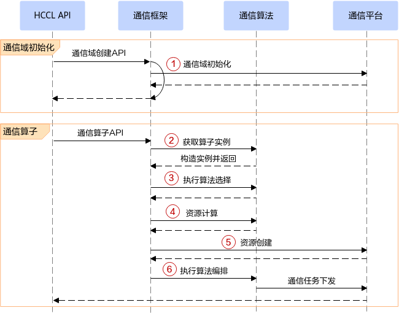

# 概述

## 读者对象

进行集合通信源码定制开发前，掌握以下经验和技能可以更好地理解本文档：

-   熟练使用C++编程语言。
-   了解集合通信HCCL软硬件架构。
-   了解集合通信基本原语及集合通信算法使用场景。

关于集合通信的先验知识，可参见《[集合通信用户指南](https://hiascend.com/document/redirect/CannCommunityHcclUg)》。

## 支持的产品型号

Atlas 训练系列产品

Atlas A2 训练系列产品

Atlas 300I Duo 推理卡

## HCCL软件执行流程

HCCL软件执行总体流程如下所示：

1.  通信域初始化：进行通信域资源与关系的维护。
2.  根据算子类型获取对应的算子实例。
3.  算法选择：通信框架调用通信算法选择接口，通信算法模块根据拓扑信息和相关配置选择合适的算法。
4.  资源计算：通信框架调用资源计算接口，通信算法模块根据前一步选择的算法，将其涉及的资源诉求（建链关系、内存需求等）返回给通信框架。
5.  资源创建：通信框架根据算法返回的资源诉求创建对应的资源（通信平台层提供资源抽象功能）。
6.  算法编排：通信框架将申请好的资源传递给通信算法，进行通信任务的编排下发。