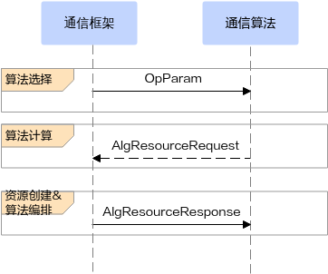

# 简介

HCCL通信框架与通信算法间交互涉及到如下数据结构。

-   参数相关

    OpParam：包含了所有算子可能用到的入参。

-   资源相关
    -   AlgResourceRequest：资源诉求，由通信算法层计算并赋值。
    -   AlgResourceResponse：资源创建的结果，由通信框架层创建并赋值。

-   建链相关

    OpCommTransport：保存建链诉求，属于资源的一种，包含以下层级：

    -   LevelNSubCommTransport：表示第几层的通信域建链诉求，一层可能包含多个子通信域。
    -   SingleSubCommTransport：单个子通信域的建链诉求。
    -   TransportRequest：单条建链诉求。

以上数据结构都定义在“src/domain/collective\_communication/algorithm/impl/inc/coll\_alg\_param.h”文件中，数据结构在软件流程中的使用场景如下图所示。

