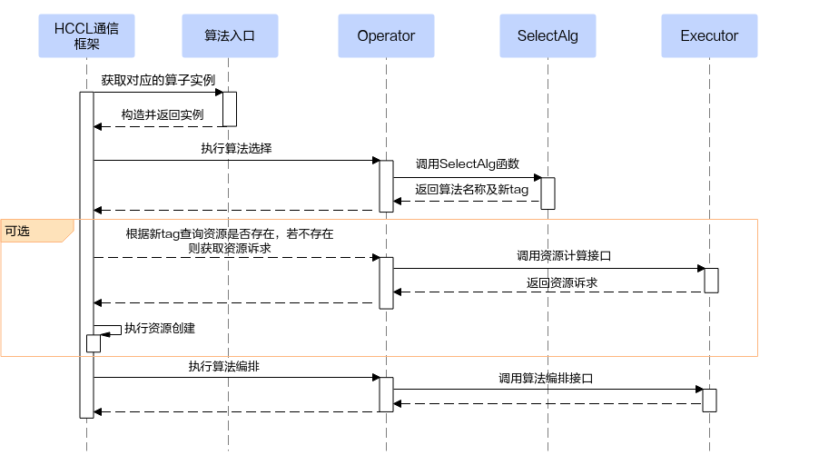
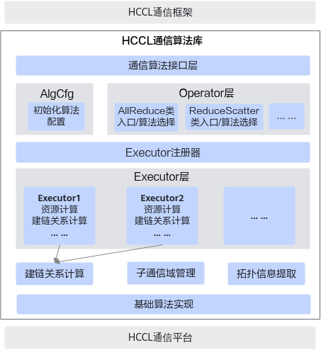
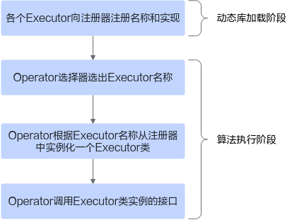

# 算法开发总体介绍

## 通信算法执行流程

在开发集合通信算法之前，需要先了解通信算法的执行流程，如下图所示：

通信算法的主体执行流程可划分为4步：

1.  HCCL通信框架根据算子类型构造出对应的算子实例。
2.  通信框架调用算子实例执行算法选择，算法选择会返回将要执行的算法名字和一个标志资源的newTag字符串。
3.  通信框架根据newTag查询对应的资源（Scratch Buffer、从流、主从流同步的notify、transport链路）是否存在，若不存在，则调用算子实例的资源计算接口获取算法执行需要的资源诉求，然后框架根据资源诉求创建对应的资源。
4.  通信框架传入算法执行需要的资源，并执行算法编排。算法编排执行的过程中，会通过平台层的接口提交要执行的Task。

上述主体流程的[步骤2](#li462871210319)至[步骤4](#li1691510241237)，是执行一个算法的必经步骤。那么开发一个新的算法，也需要完成相应的步骤。

## 通信算法库软件架构

上图所示是HCCL通信算法库软件架构，通信算法库向上对接通信框架，向下调用平台层接口实现算法编排。算法库各子模块的功能如下：

- 通信算法接口层：对通信框架提供统一的调用入口。
- AlgCfg：初始化AlgType（算法类型），提供算法库的配置接口。
- Operator层：每个算子都需实现自己的Operator子类，Operator子类中实现了算法选择功能。
- Executor注册器：算法库提供了统一的Executor注册器，用于插件化管理Excetutor对象。
- Executor层：每一个Executor对象都提供了一个完整的算法实现，包括计算算法编排所需资源、计算建链关系、组合基础算法实现算子功能、控制子图复用等逻辑。
- 建链关系计算：提供一些公共的建链关系计算方法。
- 子通信域管理：提供算子rank到子通信域rank的映射等功能。
- 拓扑信息提取：按拓扑结构对通信域中的rank进行分层，比如server内为一级，server间为一级。
- 基础算法实现：算法的实际编排逻辑实现。

算法选择的逻辑实现在Operator对象中，资源计算和算法编排的逻辑实现在Executor中，Opeartor只是做一个分发。

Operator、Executor及Executor注册器之间的调用关系如下：

