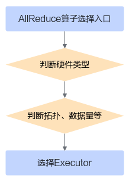

# 适配算法选择阶段<a name="ZH-CN_TOPIC_0000001904826482"></a>

每个算法都有自己的适用范围，在其适用范围内该算法往往是性能最佳的，所以当用户新增算法实现后，需要修改对应的算法选择逻辑，以在满足特定条件时选中用户新增的算法。本章主要介绍算法选择逻辑的大致实现，方便用户阅读和修改代码。

每个算子有独立的SelectAlg接口，以AllReduce算子为例，SelectAlg接口的实现在文件“src/domain/collective\_communication/algorithm/impl/operator/all\_reduce\_operator.cc”中。

开发者可修改对应算子的“SelectAlg”函数实现算法选择，“SelectAgl”接口的定义如下：

```
virtual HcclResult SelectAlg(const std::string& tag, const OpParam& param, std::string& algName, std::string& newTag);
```

接口中每个参数的说明如下表所示：

<a name="table827101275518"></a>

<table><thead align="left"><tr id="row429121265517"><th class="cellrowborder" valign="top" width="40%" id="mcps1.1.4.1.1"><p id="p1329121214558"><a name="p1329121214558"></a><a name="p1329121214558"></a>参数</p>
</th>
<th class="cellrowborder" valign="top" width="20%" id="mcps1.1.4.1.2"><p id="p10230141454318"><a name="p10230141454318"></a><a name="p10230141454318"></a>输入/输出</p>
</th>
<th class="cellrowborder" valign="top" width="40%" id="mcps1.1.4.1.3"><p id="p83121275519"><a name="p83121275519"></a><a name="p83121275519"></a>说明</p>
</th>
</tr>
</thead>
<tbody><tr id="row1131131265511"><td class="cellrowborder" valign="top" width="40%" headers="mcps1.1.4.1.1 "><p id="p191061137121320"><a name="p191061137121320"></a><a name="p191061137121320"></a>tag</p>
</td>
<td class="cellrowborder" valign="top" width="20%" headers="mcps1.1.4.1.2 "><p id="p16105133721316"><a name="p16105133721316"></a><a name="p16105133721316"></a>输入</p>
</td>
<td class="cellrowborder" valign="top" width="40%" headers="mcps1.1.4.1.3 "><p id="p10105143741311"><a name="p10105143741311"></a><a name="p10105143741311"></a>算子在通信域中的标记，用于维测功能。</p>
</td>
</tr>
<tr id="row18118485118"><td class="cellrowborder" valign="top" width="40%" headers="mcps1.1.4.1.1 "><p id="p11104837101311"><a name="p11104837101311"></a><a name="p11104837101311"></a>param</p>
</td>
<td class="cellrowborder" valign="top" width="20%" headers="mcps1.1.4.1.2 "><p id="p8103173701314"><a name="p8103173701314"></a><a name="p8103173701314"></a>输入</p>
</td>
<td class="cellrowborder" valign="top" width="40%" headers="mcps1.1.4.1.3 "><p id="p151038375137"><a name="p151038375137"></a><a name="p151038375137"></a>算子的入参，包括输入输出指针、数据量等信息。</p>
<p id="p46091429145913"><a name="p46091429145913"></a><a name="p46091429145913"></a>OpParam数据结构的介绍可参见<a href="OpParam.md">OpParam</a>。</p>
</td>
</tr>
<tr id="row191899195459"><td class="cellrowborder" valign="top" width="40%" headers="mcps1.1.4.1.1 "><p id="p131025371133"><a name="p131025371133"></a><a name="p131025371133"></a>algName</p>
</td>
<td class="cellrowborder" valign="top" width="20%" headers="mcps1.1.4.1.2 "><p id="p191021937151315"><a name="p191021937151315"></a><a name="p191021937151315"></a>输出</p>
</td>
<td class="cellrowborder" valign="top" width="40%" headers="mcps1.1.4.1.3 "><p id="p3101437131315"><a name="p3101437131315"></a><a name="p3101437131315"></a>返回的所选择算法的名字，即Executor注册<span id="ph264915717323"><a name="ph264915717323"></a><a name="ph264915717323"></a>器</span>的名字。</p>
<p id="p78451625519"><a name="p78451625519"></a><a name="p78451625519"></a>算法库提供了统一的Executor注册器，不管是内置算法还是自定义算法都需要通过注册器向算法库进行注册。</p>
<p id="p1733220194412"><a name="p1733220194412"></a><a name="p1733220194412"></a>注册宏代码位于“src/domain/collective_communication/algorithm/impl/coll_executor/registry/coll_alg_exec_registry.h”文件中。</p>
<p id="p58971810204820"><a name="p58971810204820"></a><a name="p58971810204820"></a>使用示例如下：</p>
<pre class="screen" id="screen976916333502"><a name="screen976916333502"></a><a name="screen976916333502"></a>REGISTER_EXEC("AllGatherComm", AllGatherComm, CollAllGatherCommExecutor);</pre>
<p id="p42548501720"><a name="p42548501720"></a><a name="p42548501720"></a>第一个参数是算法名字；第二个参数用于拼接全局静态变量的名字，可与第一个参数一致；第三个参数是Executor的实现子类。</p>
</td>
</tr>
<tr id="row1576074985117"><td class="cellrowborder" valign="top" width="40%" headers="mcps1.1.4.1.1 "><p id="p2076016494512"><a name="p2076016494512"></a><a name="p2076016494512"></a>newTag</p>
</td>
<td class="cellrowborder" valign="top" width="20%" headers="mcps1.1.4.1.2 "><p id="p5761144910517"><a name="p5761144910517"></a><a name="p5761144910517"></a>输出</p>
</td>
<td class="cellrowborder" valign="top" width="40%" headers="mcps1.1.4.1.3 "><p id="p197619498511"><a name="p197619498511"></a><a name="p197619498511"></a>一个标记字符串，用于在框架侧缓存Executor资源，避免资源多次申请。</p>
</td>
</tr>
</tbody>
</table>


算法选择的逻辑当前是一个决策树，以AllReduce算子举例，SelectAlg入口先判断硬件类型，硬件类型确定后再根据拓扑、数据量等信息选出要执行的Executor名称，如下图所示：



**说明：**HCCL源码中的硬件类型体现的是Soc Version，您可以在安装昇腾AI处理器的服务器中执行“**npu-smi info**”命令查询，查询到的“Chip Name”即为对应的Soc Version。

AllReduce算子SelectAlg函数的主流程代码示例如下（**下面示例代码中的_<Soc Version\>_与SelectAlgforXXX中的_XX__X_请替换为“npu-smi info”查询到的“Chip Name”**）：

```
HcclResult AllReduceOperator::SelectAlg(const std::string& tag, const OpParam& param, std::string& algName, std::string& newTag)
{
    if (userRankSize_ == 1 && GetWorkflowMode() == HcclWorkflowMode::HCCL_WORKFLOW_MODE_OP_BASE) {
        algName = "AllReduceSingleExecutor";
        return HCCL_SUCCESS;
    }
    HcclResult ret;
    // 根据硬件类型进入不同的分支，例如：
    if (deviceType_ == DevType::DEV_TYPE_<Soc Version>) {
        ret = SelectAlgforXXX(param, algName);
    } else if (deviceType_ == DevType::DEV_TYPE_<Soc Version>) {
        ret = SelectAlgforXXX(param, algName);
    } else {
        HCCL_ERROR("[SelectAlg] device type[%d] is out of range for selector.", deviceType_);
        return HCCL_E_NOT_SUPPORT;
    }
    // 单算子模式下，产生newTag用于在框架测缓存资源
    if (GetWorkflowMode() == HcclWorkflowMode::HCCL_WORKFLOW_MODE_OP_BASE) {
        // 针对Atlas 推理系列产品（Ascend 310P处理器）中的加速卡
        if (Is310P3Common()) {
            newTag = tag + algName;
        } else {
            AlgTypeLevel1 algType1 = GetLevel1AlgType(algType_);
            auto level1Iter = HCCL_ALGO_LEVEL1_NAME_MAP.find(algType1);
            newTag = tag + level1Iter->second + algName;
        }
    } else {
        // 图模式下，newTag等于输入的tag，不做修改
        newTag = tag;
    }
    HCCL_INFO("[SelectAlg] all_reduce newTag is [%s]", newTag.c_str());
    CHK_PRT_RET(ret != HCCL_SUCCESS, HCCL_ERROR("[AllReduceSelector][SelectAlg]tag[%s], all_reduce failed, return[%d]", tag.c_str(), ret), ret);
    return ret;
}
```

具体到Atlas 训练系列产品的算法选择代码示例如下：

```
HcclResult AllReduceOperator::SelectAlgfor910A(const OpParam& param, std::string& algName)
{
    bool isMeshTopo = topoType_ == TopoType::TOPO_TYPE_4P_MESH || topoType_ == TopoType::TOPO_TYPE_2P_MESH;
    bool isRingTopo = topoType_ == TopoType::TOPO_TYPE_NP_SINGLE_RING || topoType_ == TopoType::TOPO_TYPE_8P_RING;
    // 根据topo类型返回算法的名字
    if (isMeshTopo) {
        algName = "AllReduceMeshExecutor";
    } else if (isRingTopo) {
        algName = "AllReduceRingExecutor";
    } else {
        algName = "AllReduceComm";
    }
    HCCL_INFO("[SelectAlgfor910A] all_reduce SelectAlgfor910A is algName [%s]", algName.c_str());
    return HCCL_SUCCESS;
}
```

