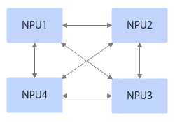
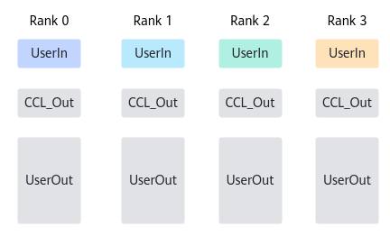
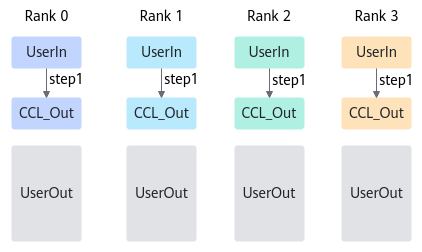
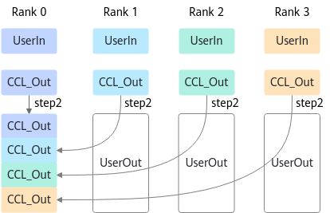

# 适配资源计算阶段<a name="ZH-CN_TOPIC_0000001941345877"></a>

每个算法执行都需要一定的资源，包括主流/从流，主从流同步的Notify、Buffer、Transport链路等（相应的概念可参见[背景知识](背景知识.md)），算法库提供了相应的资源计算接口，方便Executor获取自己需要的资源诉求。

资源计算的接口定义如下：

```
virtual HcclResult CalcResRequest(const OpParam& param, AlgResourceRequest& resourceRequest)
```

<a name="table827101275518"></a>

<table><thead align="left"><tr id="row429121265517"><th class="cellrowborder" valign="top" width="30" id="mcps1.1.4.1.1"><p id="p1329121214558"><a name="p1329121214558"></a><a name="p1329121214558"></a>参数</p>
</th>
<th class="cellrowborder" valign="top" width="20%" id="mcps1.1.20.1.2"><p id="p10230141454318"><a name="p10230141454318"></a><a name="p10230141454318"></a>输入/输出</p>
</th>
<th class="cellrowborder" valign="top" width="50%" id="mcps1.1.4.1.3"><p id="p83121275519"><a name="p83121275519"></a><a name="p83121275519"></a>说明</p>
</th>
</tr>
</thead>
<tbody><tr id="row18118485118"><td class="cellrowborder" valign="top" width="30%" headers="mcps1.1.4.1.1 "><p id="p11104837101311"><a name="p11104837101311"></a><a name="p11104837101311"></a>param</p>
</td>
<td class="cellrowborder" valign="top" width="20%" headers="mcps1.1.4.1.2 "><p id="p8103173701314"><a name="p8103173701314"></a><a name="p8103173701314"></a>输入</p>
</td>
<td class="cellrowborder" valign="top" width="50%" headers="mcps1.1.4.1.3 "><p id="p151038375137"><a name="p151038375137"></a><a name="p151038375137"></a>算子的入参，包括输入输出指针、数据量等信息。</p>
<p id="p761719529586"><a name="p761719529586"></a><a name="p761719529586"></a>OpParam数据结构的介绍可参见<a href="OpParam.md">OpParam</a>。</p>
</td>
</tr>
<tr id="row191899195459"><td class="cellrowborder" valign="top" width="30%" headers="mcps1.1.4.1.1 "><p id="p1721319238619"><a name="p1721319238619"></a><a name="p1721319238619"></a>resourceRequest</p>
</td>
<td class="cellrowborder" valign="top" width="20%" headers="mcps1.1.4.1.2 "><p id="p191021937151315"><a name="p191021937151315"></a><a name="p191021937151315"></a>输出</p>
</td>
<td class="cellrowborder" valign="top" width="50%" headers="mcps1.1.4.1.3 "><p id="p3101437131315"><a name="p3101437131315"></a><a name="p3101437131315"></a>AlgResourceRequest对象，存储Executor执行需要的资源诉求，包含从流数量、主从流同步需要的<span id="ph1159741718289"><a name="ph1159741718289"></a><a name="ph1159741718289"></a>N</span>otify数量、Scratch Buffer、建链诉求等信息。</p>
<p id="p93721932297"></a>AlgResourceRequest数据结构的介绍可参见<a href="AlgResourceRequest.md">AlgResourceRequest</a>。</p>
</td>
</tr>
</tbody>
</table>


Executor执行过程中，不同的rank间需要进行通信，rank间通信依赖框架提前创建好对应的transport链路。Executor需要的建链诉求用结构体OpCommTransport表示，结构体OpCommTransport是一个vector，vector元素为LevelNSubCommTransport。对于多机的集合通信，算法的执行通常是分层的，OpCommTransport表示所有层的建链诉求的集合，LevelNSubCommTransport表示每一层的建链诉求。一层的建链诉求可能会有多个子通信域组成，因此LevelNSubCommTransport也是一个vector，其成员为SingleSubCommTransport，表示某一层某个子通信域的建链诉求。关于OpCommTransport数据结构的介绍可参见[OpCommTransport](OpCommTransport.md)。

算法库提供了基类CollExecutorBase，用户实现的Executor需要继承自该基类。适配资源诉求就是要在Executor子类中，实现CalcResRequest接口，将资源诉求等信息填在结构体AlgResourceRequest中。

CalcResRequest接口的代码示例如下所示：

```
HcclResult CollNativeExecutorBase::CalcResRequest(const OpParam& param, AlgResourceRequest& resourceRequest)
{
    (void)ParseParam(param);
    u64 scratchMemSize = 0U;
    u32 streamNum = 0U;
    u32 notifyNum = 0U;
    bool needAivBuffer = false;
    std::vector<LevelNSubCommTransport> opTransport {
        std::vector<LevelNSubCommTransport>(static_cast<u32>(COMM_LEVEL_RESERVED))
    };
    // 计算Scratch Buffer的内存的大小
    CHK_RET(CalcScratchMemSize(scratchMemSize));
    // 计算需要的从流的数量
    CHK_RET(CalcStreamNum(streamNum));
    // 计算同步需要的notify的数量
    CHK_RET(CalcNotifyNum(streamNum, notifyNum));
    CHK_RET(GetIfNeedAivBuffer(needAivBuffer));
    // 计算建链的诉求
    CHK_RET(CalcCommInfo(opTransport));
    // 填入结构体resourceRequest
    CHK_RET(BuildResourceRequest(scratchMemSize, streamNum, notifyNum, needAivBuffer, opTransport, resourceRequest));
    HCCL_INFO("streamNum[%u], notifyNum[%u], sctrachMemSize[%llu], needAivBuffer[%u]",
        resourceRequest.streamNum, resourceRequest.notifyNum, resourceRequest.scratchMemSize,
        resourceRequest.needAivBuffer);
    // 打印建链诉求
    PrintTransportRequest(resourceRequest);
    return HCCL_SUCCESS;
}
```

算法中所需的资源数量需要根据算法原理进行分析，以Atlas A2 训练系列产品执行AllGather算子为例，假设组网中只有一个AI Server，Server中有4个NPU，每个NPU与另外三个NPU都有独立的HCCS链路，需要实现Server内的Mesh算法，硬件拓扑如下：



Buffer初始状态如下图，每个Rank只有UserIn（输入Buffer）中存在有效数据。Rank之间使用CCL内存交换数据，本算法只使用CCL\_Out。



算法执行过程中资源变化如下所示：

1.  将数据从UserIn搬移到CCL\_Out。

    

2.  每个Rank同时从本Rank的CCL\_Out和其他Rank的CCL\_Out读取数据，并写到自己的UserOut（输出Buffer）的对应位置。这边只画了Rank0的数据搬运方向，其他Rank的搬运方式是类似的。

    

通过上述算法原理，可得到各资源的数量为：

-   通信域内rankSize（即参与通信的实体个数）为4。
-   从第二步可看出，Rank内有rankSize块数据并发搬运，共需要rankSize条流，主流的数量为1，从流的数量是rankSize-1。
-   主从流同步的Notify数量为\(rankSize - 1\) \* 2，Transport同步的Notify随transport链路自动申请，无需单独计算。
